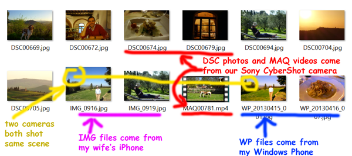
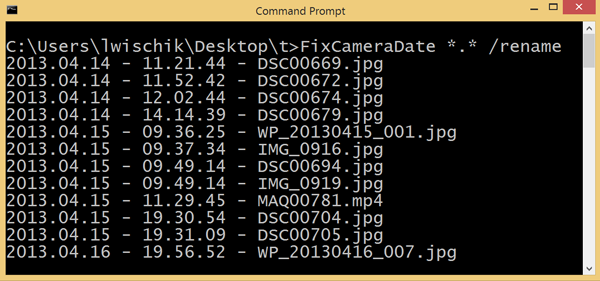
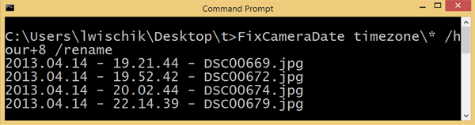
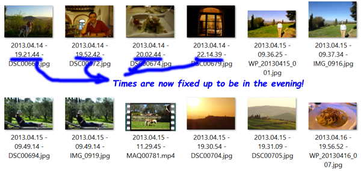

# FixCameraDate

* Download [FixCameraDate.exe](FixCameraDate.exe) [22k]

Do you have photos or videos of an event from several phones/cameras? Do you want to consolidate them into the right order? FixCameraDate will help!

 My wife and I went on honeymoon to Italy. When we came back and gathered together all our photos - from her iPhone, from my Windows Phone, and from our Sony Cybershot - they were all jumbled up.



I tried using the Details view to sort them by their date, but that didn't help either.


So what can be done?


# FixCameraDate

FixCameraDate is a command-line tool to help you put all your photos and videos in the correct order, even if they came from different devices, even if some devices might have been set to the wrong timezone.

 The instructions here show you how to use it. If you want to learn more about how things work under the hood, or if the tool isn't doing what you think it should be doing, see the "Documentation" page.

 Note: this is a command-line utility. If you've never used a command-prompt before, then this tool probably isn't the best one for you..


## Installation

Download [FixCameraDate.exe](FixCameraDate.exe). Once it's downloaded onto your computer, copy it into your Windows folder, `C:\Windows\FixCameraDate.exe`

 (Advanced option: actually you can save it to any folder you want, but if so you'd have to add it to Control Panel > Advanced system settings > Environment Variables > System Variables > Path).


## How to use FixCameraDate

(1) Open a command-prompt and navigate to the folder with all your photos and videos.

(2) Type this command:
```
FixCameraDate * /rename
```


This will rename all photos and videos in that folder so they're now in the correct order. (at least they will be if you're viewing them sorted by filename!)


 
Note that FixCameraDate uses International Standard date-order (YYYY-MM-DD) and it uses the 24-hour clock (HH:MM:SS). This is deliberate, to make it so that sorting-by-filename will be useful.

(Advanced option: as described on the "Documentation" page, you can make it use American date order MM/DD/YYYY. This will get confusing though, since if you have a folder of photos over the Christmas holidays, it will list January before December!)


## How to deal with wrong timezones

Actually, I noticed that the first four photos are in the wrong timezone, off by 8 hours. So I'm going to fix that up.

(1) Move the wrong-timezone photos and videos into their own separate directory, just for now. I use the name "Timezone" for this directory.


(2) Type this command:
```
FixCameraDate Timezone\* /hour+8 /rename
```


That has fixed up the timezone on the affected photos and videos, marking them as 8 hours later. Now you can cut/paste them back into the main photo folder.


